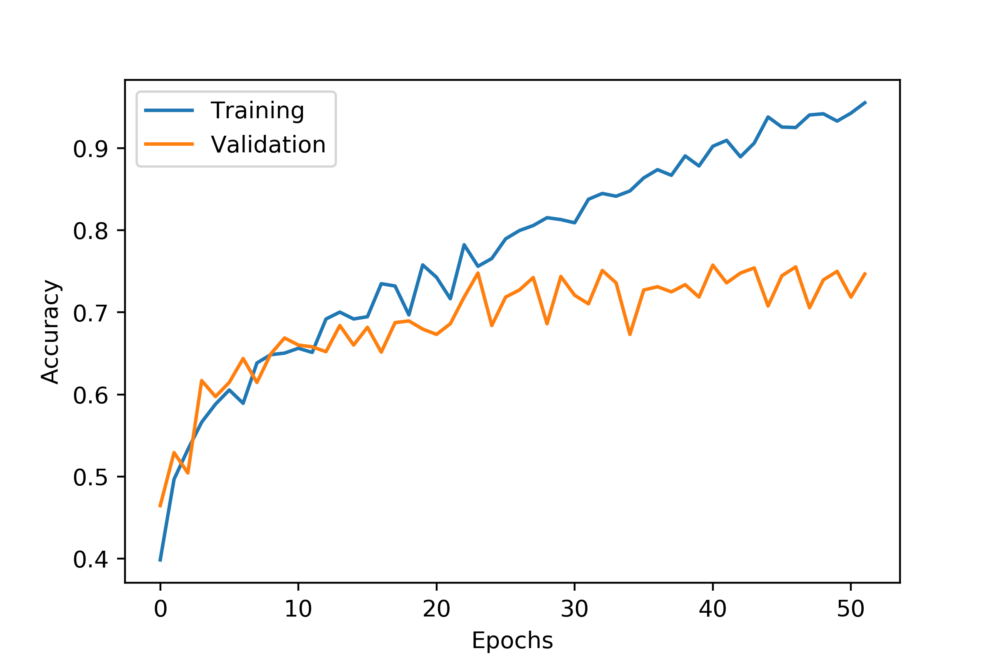
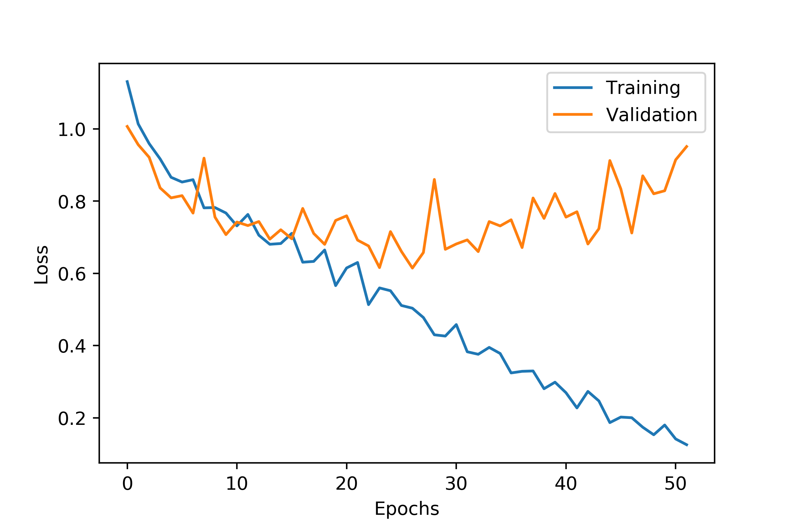

# Painting Forensics
Analyzing paintings to find out their year of creation. By using CNNs and combined with a pre-trained VGG19 model we 
can find out in what year the painting was painted. In this research we are distributing a dataset of color paintings
into multiple classes based on which art epoch they were painted in.

This project is initially inspired by the Kaggle task to 
detect the author of a given painting: https://www.kaggle.com/c/painter-by-numbers 

This is an on-going research, the results reflected are preliminary.

The dataset is not included, you can generate your own dataset either from the kaggle task linked above or directly 
from www.wikiart.org

### Current results

##### More information and analysis of current results in the attached paper
